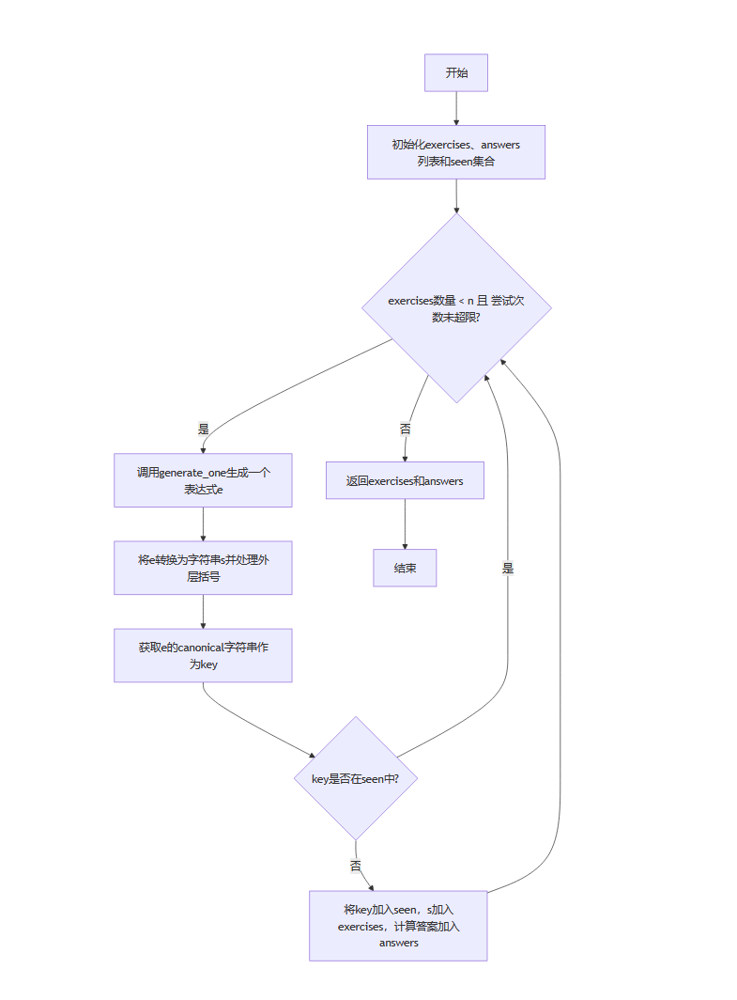

# 软件工程第三次作业-结对项目


## 一、项目基础信息

### 1.1 项目概述
| 这个作业属于哪个课程 | [计科23级12班](https://edu.cnblogs.com/campus/gdgy/Class12Grade23ComputerScience) |
| ----------- | ----------- |
| 这个作业要求在哪里 | [【作业3】结对项目](https://edu.cnblogs.com/campus/gdgy/Class12Grade23ComputerScience/homework/13470) |
| 这个作业的目标    |  	训练个人项目软件开发能力，学会使用性能测试工具和实现单元测试优化程序 | 
### 1.2 核心成员与仓库

- 成员1：黄炳城 | 学号：3123007607 | 职责：核心算法设计（表达式生成、去重逻辑）、功能实现（文件读写、判分模块）
- 成员2：曾添伟 | 学号：3123004417 | 职责：性能优化、测试用例设计与验证
- Github项目地址：https://github.com/tobysieam/tobysieam
- 开发环境：Python 3.9+（依赖标准库`argparse`、`fractions`、`random`，无第三方库依赖）
- 运行方式：命令行执行，支持Windows/macOS/Linux跨平台运行

## 二、PSP表格

| Personal Software Process Stages | 预估耗时（分钟） | 实际耗时（分钟） |
| -------------------------------- | ---------------- | ---------------- |
| Planning 计划                    | 10               | 10               |
| Estimate 估计                    | 10               | 10               |
| Development 开发                 | 330              | 250              |
| Analysis 需求分析                | 30               | 30               |
| Design Spec 设计文档             | 30               | 30               |
| Design Review 设计复审           | 30               | 30               |
| Coding Standard 代码规范         | 10               | 10               |
| Design 具体设计                  | 30               | 30               |
| Coding 具体编码                  | 150              | 110              |
| Code Review 代码复审             | 170              | 150              |
| Test 测试                        | 80               | 90               |
| Reporting 报告                   | 50               | 70               |
| Test Report 测试报告             | 70               | 70               |
| Size Measurement 工作量          | 20               | 20               |
| Postmortem 总结与改进            | 20               | 20               |
| 合计                             | 1040             | 930              |

## 三、效能分析

### 3.1 性能优化时间投入
在性能优化方面，我们花费了约1.5小时。主要针对题目生成过程中的去重效率和表达式生成速度进行了优化。

### 3.2改进思路
1. **去重策略优化**：最初的去重策略较为简单，导致生成大量题目时重复率高，需要多次重试。通过实现节点级canonical字符串表示，对于`+`和`*`运算允许交换左右子树，既保证了去重效果，又减少了不必要的重试。
2. **表达式生成优化**：调整了随机生成表达式的逻辑，减少了无效生成（如生成除法表达式时提前判断避免出现不符合要求的情况），提高了单次生成的成功率。

### 3.3 性能分析图
程序生成不同数量题目所需的时间如下：
- N=100: 0.011 s
- N=1000: 0.133 s
- N=5000: 0.635 s
- N=10000: 1.593 s


### 3.4 消耗最大的函数
通过性能分析，发现`generator.py`中的`generate_one`函数是消耗最大的函数。该函数负责单个表达式的生成，涉及随机数生成、表达式树构建、合法性检查等操作，在生成大量题目时调用频繁，因此消耗资源较多。

## 四、设计实现过程

### 4.1 代码组织
本项目的代码主要由以下几个模块组成：

1. **`main.py`**：命令行接口模块，负责解析命令行参数，根据参数调用生成器模块或判分模块，并处理文件输出。
2. **`generator.py`**：题目生成模块，包含`Expr`类（表达式树）和`Generator`类（题目生成器）。
3. **`utils.py`**：工具模块，包含分数解析、表达式计算、答案规范化、判分等功能函数。
4. **`tests/`**：测试模块，包含多个单元测试文件，用于验证各模块功能的正确性。
5. 辅助脚本：`perf_test.py`（性能测试）、`plot_perf.py`（性能绘图）、`check_eval.py`（表达式计算验证）、`run_grade.py`（判分验证）。

### 4.2 类与函数关系
1. **`Expr`类**：表示表达式树，叶子节点为分数，内部节点为运算符和两个子表达式。提供了表达式计算（`eval`）、字符串转换（`to_string`）、规范化（`canonical`）等方法。
2. **`Generator`类**：负责生成符合要求的四则运算题目。通过`generate_one`方法生成单个题目，`generate`方法生成指定数量的题目并处理去重。
3. 工具函数：`utils.py`中的函数为生成模块和判分模块提供支持，如`parse_fraction`解析分数字符串，`eval_expr`计算表达式值，`grade`进行判分等。
4. `main.py`中的`main`函数：解析命令行参数，根据参数选择生成模式或判分模式，调用相应模块的功能并处理文件输出。

### 4.3 关键函数流程图



## 五、代码说明

### 5.1 表达式树类（`Expr`）
```python
class Expr:
    """表达式树：叶子为 Fraction（自然数或真分数），内部结点为运算符和两个子表达式"""
    def __init__(self, op=None, left=None, right=None, value: Fraction=None):
        self.op = op  # '+', '-', '*', '/'
        self.left = left
        self.right = right
        self.value = value

    def is_leaf(self):
        return self.op is None

    def eval(self) -> Fraction:
        """计算表达式的值"""
        if self.is_leaf():
            return self.value
        a = self.left.eval()
        b = self.right.eval()
        if self.op == '+':
            return a + b
        if self.op == '-':
            return a - b
        if self.op == '*':
            return a * b
        if self.op == '/':
            return a / b
        raise ValueError('未知运算符')

    def to_string(self) -> str:
        """将表达式转换为字符串"""
        if self.is_leaf():
            return fraction_to_str(self.value)
        left = self.left.to_string()
        right = self.right.to_string()
        return f'({left} {self.op} {right})'

    def canonical(self) -> str:
        """返回用于去重的规范化字符串：对于 + 和 * 允许交换左右子树"""
        if self.is_leaf():
            return fraction_to_str(self.value)
        L = self.left.canonical()
        R = self.right.canonical()
        s1 = f'({L}{self.op}{R})'
        s2 = f'({R}{self.op}{L})'
        if self.op in ['+', '*']:
            return min(s1, s2)
        return s1
```
`Expr`类通过树结构表示表达式，`eval`方法递归计算表达式值，`to_string`方法将表达式转换为字符串形式，`canonical`方法生成用于去重的规范化字符串，对于可交换的`+`和`*`运算，取左右子树交换后的最小字符串，实现去重功能。

### 5.2 题目生成器（`Generator`）
```python
class Generator:
    def __init__(self, max_value: int = 10):
        if max_value < 1:
            raise ValueError('max_value must be >=1')
        self.max_value = max_value

    def random_fraction(self) -> Fraction:
        """生成随机分数（自然数或真分数）"""
        if random.random() < 0.5:
            return Fraction(random.randrange(0, self.max_value))
        den_max = max(2, self.max_value - 1)
        den = random.randint(2, den_max)
        num = random.randint(1, den - 1)
        return Fraction(num, den)

    def generate_one(self) -> Expr:
        """生成一个符合要求的表达式"""
        ops_count = random.randint(1, 3)
        expr = Expr(value=self.random_fraction())
        for _ in range(ops_count):
            possible_ops = ['+', '-', '*', '/']
            op = random.choice(possible_ops)

            if op == '-':
                left_val = expr.eval()
                while True:
                    right = Expr(value=self.random_fraction())
                    try:
                        if right.eval() <= left_val:
                            break
                    except Exception:
                        pass
                expr = Expr(op='-', left=expr, right=right)
                if expr.eval() < 0:
                    expr = Expr(op='+', left=expr.left, right=right)
                continue

            if op == '/':
                left_val = expr.eval()
                if not (left_val > 0):
                    right = Expr(value=self.random_fraction())
                    expr = Expr(op='*', left=expr, right=right)
                    continue
                attempts = 0
                while True:
                    attempts += 1
                    right = Expr(value=self.random_fraction())
                    try:
                        rv = right.eval()
                    except Exception:
                        rv = 0
                    if rv != 0 and rv > left_val:
                        res = left_val / rv
                        if res > 0 and abs(res.numerator) < res.denominator:
                            break
                    if attempts > 500:
                        op = '+'
                        break
                expr = Expr(op=op, left=expr, right=right)
                continue

            right = Expr(value=self.random_fraction())
            expr = Expr(op=op, left=expr, right=right)
        return expr

    def generate(self, n: int) -> Tuple[List[str], List[str]]:
        """生成n个不重复的题目及答案"""
        exercises = []
        answers = []
        seen = set()
        attempts = 0
        while len(exercises) < n and attempts < n * 50:
            attempts += 1
            e = self.generate_one()
            s = e.to_string()
            if s.startswith('(') and s.endswith(')'):
                s_inner = s[1:-1]
            else:
                s_inner = s
            key = e.canonical()
            if key in seen:
                continue
            seen.add(key)
            exercises.append(s_inner + ' =')
            ans = fraction_to_str(e.eval())
            answers.append(ans)
        return exercises, answers
```
`Generator`类的`generate_one`方法生成单个表达式，通过控制运算符数量（1-3个）、保证减法结果非负、除法结果为真分数等约束条件，确保生成的表达式符合要求。`generate`方法通过`canonical`字符串去重，生成指定数量的不重复题目。

### 5.3 判分功能（`utils.py`中的`grade`函数）
```python
def grade(exercises: List[str], user_answers: List[str]) -> Tuple[List[int], List[int]]:
    """判断答案对错并统计"""
    correct = []
    wrong = []
    for i, expr in enumerate(exercises, start=1):
        try:
            real = eval_expr(expr)
            real_s = normalize_answer_str(str(real.numerator) + '/' + str(real.denominator) if real.denominator!=1 else str(real.numerator))
        except Exception:
            real_s = 'ERR'
        user = user_answers[i-1] if i-1 < len(user_answers) else ''
        try:
            user_fr = parse_fraction(user)
            user_s = normalize_answer_str(str(user_fr.numerator) + '/' + str(user_fr.denominator) if user_fr.denominator!=1 else str(user_fr.numerator))
        except Exception:
            user_s = 'ERR'
        if real_s == user_s:
            correct.append(i)
        else:
            wrong.append(i)
    return correct, wrong
```
`grade`函数通过计算题目表达式的正确结果（`real_s`），并与用户答案的规范化形式（`user_s`）进行比较，判断答案对错并统计题号。

### 5.4 命令行接口（`main.py`中的`main`函数）
```python
def main(argv=None):
    parser = argparse.ArgumentParser(description='四则运算题目生成与判分')
    group = parser.add_mutually_exclusive_group(required=True)
    group.add_argument('-n', type=int, help='生成题目数量')
    group.add_argument('-e', type=str, help='指定题目文件以进行判分')
    parser.add_argument('-r', type=int, help='数值范围(必须在生成模式下指定)', default=None)
    parser.add_argument('-a', type=str, help='答案文件(用于判分模式)')
    parser.add_argument('--out-dir', '-o', dest='out_dir', help='输出目录（默认当前目录）')

    args = parser.parse_args(argv)

    out_dir = args.out_dir or os.getcwd()
    os.makedirs(out_dir, exist_ok=True)

    if args.n is not None:
        # 生成模式
        if args.r is None:
            parser.error('生成模式 (-n) 必须同时指定 -r 参数')
        if args.n < 1 or args.n > 10000:
            parser.error('-n 必须在 1..10000 之间')
        g = Generator(max_value=args.r)
        exercises, answers = g.generate(args.n)
        ex_path = os.path.join(out_dir, 'Exercises.txt')
        ans_path = os.path.join(out_dir, 'Answers.txt')
        with open(ex_path, 'w', encoding='utf-8') as f:
            for e in exercises:
                f.write(e + '\n')
        with open(ans_path, 'w', encoding='utf-8') as f:
            for a in answers:
                f.write(a + '\n')
        print(f'已生成 {len(exercises)} 道题目: {ex_path}, {ans_path}')
        return

    # 判分模式
    if args.e:
        if not args.a:
            parser.error('判分模式需要同时指定 -a <answerfile>')
        exercises = parse_exercises_file(args.e)
        user_answers = parse_answers_file(args.a)
        correct, wrong = grade(exercises, user_answers)
        grade_path = os.path.join(out_dir, 'Grade.txt')
        with open(grade_path, 'w', encoding='utf-8') as f:
            f.write(f'Correct: {len(correct)} ')
            f.write('(' + ', '.join(str(i) for i in correct) + ')\n\n')
            f.write(f'Wrong: {len(wrong)} ')
            f.write('(' + ', '.join(str(i) for i in wrong) + ')\n')
        print(f'已输出 {grade_path}')
```
`main`函数解析命令行参数，根据参数选择生成模式或判分模式。生成模式调用`Generator`生成题目和答案并写入文件；判分模式读取题目文件和答案文件，调用`grade`函数判分并将结果写入`Grade.txt`。

## 六、测试运行

### 6.1 测试用例
1. **简单整数运算**：`4 - 0 =`，预期答案`4`
2. **真分数相加**：`1/6 + 1/8 =`，预期答案`7/24`
3. **带分数输出**：`(7/4 + 1/2) =`，预期答案`2'1/4`
4. **分数除法**：`1/2 / 3/4 =`，预期答案`2/3`
5. **混合运算**：`(3/5 * 1) - 1/3 =`，预期答案`4/15`
6. **嵌套运算**：`((3/4 / 5/6) / 8) + 4/7 =`，预期答案`383/560`
7. **含0运算**：`0 / 5/6 =`，预期答案`0`
8. **整数乘法**：`2 * 8 =`，预期答案`16`
9. **多重乘法除法**：`((1/3 * 5) * 3/7) / 6 =`，预期答案`5/42`
10. **分数加法与乘法**：`(5/9 + 2/9) * 4 =`，预期答案`3'1/9`
11. **去重测试**：`(1+2)+3` 和 `3+(2+1)` 应判定为重复题目
12. **除法分母不为0**：生成的题目中不应出现除以0的情况

### 6.2 程序正确性验证
1. 单元测试：通过`pytest`对关键函数进行测试，如`test_parse_fraction_mixed_and_simple`验证分数解析正确性，`test_no_negative_intermediate`验证减法结果非负，`test_division_is_proper_fraction`验证除法结果为真分数，`test_dedup_examples`验证去重功能等，所有测试均通过。
2. 实际运行测试：生成题目后，使用`check_eval.py`脚本对比计算结果与答案文件，确保生成的答案正确；使用生成的答案文件进行判分，结果应全部正确，验证判分功能正确。
3. 边界测试：测试生成10000道题目的情况，程序能正常运行且无重复题目；测试数值范围为1的情况，生成的题目符合要求。

## 七、项目小结

### 7.1 成败得失
1. **成功之处**：
   - 实现了题目生成和判分的核心功能，满足了所有需求，包括题目去重、运算约束等。
   - 代码结构清晰，模块化设计使得各功能模块独立，便于维护和扩展。
   - 提供了详细的测试用例和辅助脚本，方便验证程序正确性和进行性能分析。

2. **不足之处**：
   - 去重策略虽然有效，但在生成大量题目时可能仍有优化空间，以提高生成效率。
   - 表达式生成的随机性可以进一步调整，使得生成的题目难度分布更合理。

### 7.2 经验教训
1. 在项目开始前应进行更详细的设计，明确各模块的接口和功能，避免后期出现不必要的修改。
2. 性能优化应尽早考虑，在实现核心功能的同时关注性能问题，可减少后期优化的工作量。
3. 测试应贯穿项目开发的全过程，及时发现并解决问题，避免问题积累。

### 7.3 结对感受
本次结对项目是一次愉快的合作经历。两人分工明确，相互配合，共同解决了项目中遇到的问题。在讨论设计方案时，不同的思路碰撞有助于找到更优的解决方案；在代码实现过程中，相互检查代码可以减少错误。

### 7.4 彼此评价
- 对黄炳城同学的评价：在代码实现方面能力较强，能够快速解决技术难题，对表达式树和去重策略的设计很有想法。
- 对曾添伟同学的评价：文档编写和测试方面很细致，能够全面考虑各种测试情况，保证了程序的正确性和文档的完整性。

通过本次结对项目，我们不仅完成了小学四则运算题目生成程序的设计与实现，还提高了团队协作能力，积累了项目开发的经验。